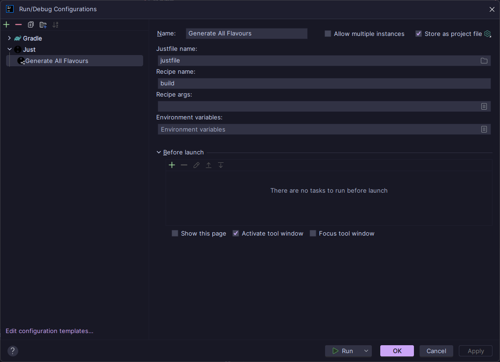

# Contributing

First, thank you for wanting to contribute! Make sure to read the
organisation-wide [CONTRIBUTING.md](https://github.com/catppuccin/.github/blob/main/CONTRIBUTING.md) first!

This document details the file structure, optimal development workflow and general notes that are useful
for contributors.

> [!IMPORTANT]  
> Please read the JetBrains [theming documentation](https://plugins.jetbrains.com/docs/intellij/developing-themes.html)
> which will answer any questions surrounding creating, running and deploying a JetBrains theme.

## File Structure

- `.github/workflows/` - CI/CD workflows for building and distributing `.jar` files
- `.run/` - Collection of useful Intellij run configuration tasks that ease the development process
- `generateFlavours/` - Typescript code that generates all 4 Catppuccin flavours into JetBrains format.
  - `editor.xml` - Highlights for everything contained within the [editor](https://www.jetbrains.com/help/idea/configuring-colors-and-fonts.html)
  - `ui.theme.json` - Highlights for everything contained within the [user interface](https://www.jetbrains.com/help/idea/user-interface-themes.html)
  - `main.ts` - Responsible for parsing the `editor.xml` and `ui.theme.json` and generating the themes
    in `src/main/resources/themes`.
- `src/main/resources/META-INF` - Contains metadata that is shipped with the built `.jar` including the logo, id, name,
  and description
- `build.gradle.kts` - Standard gradle build file defining custom build tasks
- `gradle.properties` - Properties that define the theme. E.g. name, supported version(s) and type of IDE to build
  locally for testing, etc
- `settings.gradle.kts` - Contains the root project name

## Development Workflow

### Requirements

- Just (from [package manager](https://just.systems/man/en/packages.html) or from [pre-built binaries](https://github.com/casey/just/releases))
- [Whiskers](https://whiskers.catppuccin.com/getting-started/installation/)

### Debugging Tools

JetBrains provide internal debugging tools to aid with theme creation. Please refer to the documentation below:

- [Internal Actions Menu](https://plugins.jetbrains.com/docs/intellij/internal-actions-intro.html)
- [UI Inspector](https://plugins.jetbrains.com/docs/intellij/internal-ui-inspector.html)
- [LaF Defaults](https://plugins.jetbrains.com/docs/intellij/internal-ui-laf-defaults.html)

### Task Configuration

The `.run` directory contains all the tasks required to generate the flavours, build the plugin and run the plugin.
However, these settings are not always imported correctly. I have included my personal configuration as a reference
point if you find that your tasks are not working properly.

> [!NOTE]  
> The configuration in the screenshots below contain hardcoded paths based on my personal system. Please tweak your
> configuration to suit your system setup.
>
> ~ Hammy

#### Generate All Flavours

`Generate All Flavours`

#### Build Plugin

`Build Plugin`

#### Run Plugin

`Run Plugin`

### Example Scenario

Here is an example workflow for changing the background from base to mantle:

1. Change `primaryBackground` from `base` to `mantle`
2. Run `Build Plugin` task (this will generate files under `src/main/resources/themes` and the
   resulting `.jar` file will be in `build/libs`)
3. Run `Run Plugin` task (this will spawn a new IDE with your changes already applied)
4. Observe new highlights within the test IDE instance
5. If you aren't happy with your changes, **start over from step 1**
6. Once happy, update `CHANGELOG.md` with new updates to the theme under relevant headings
7. Push changes to a new branch on your fork
8. Create pull request to the `main` branch on the main repository
