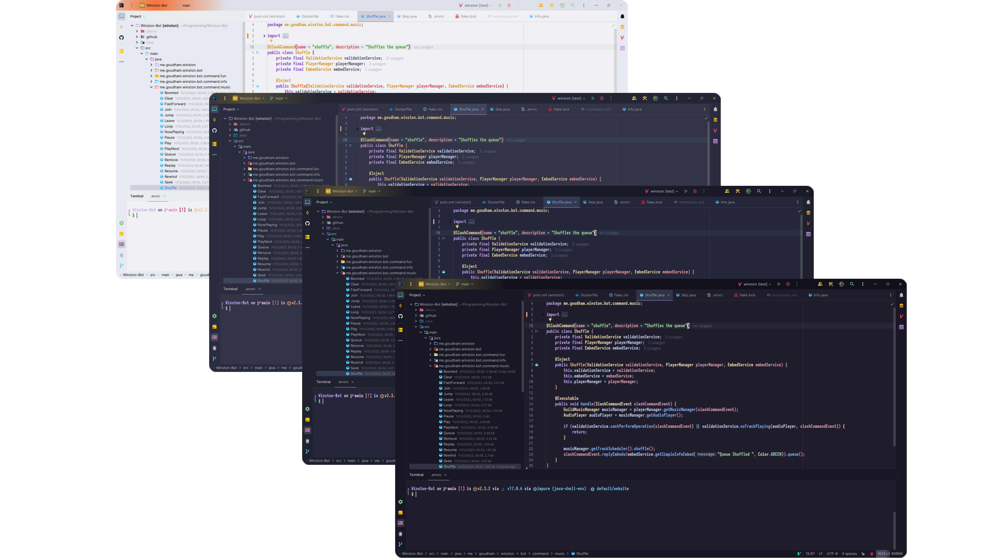
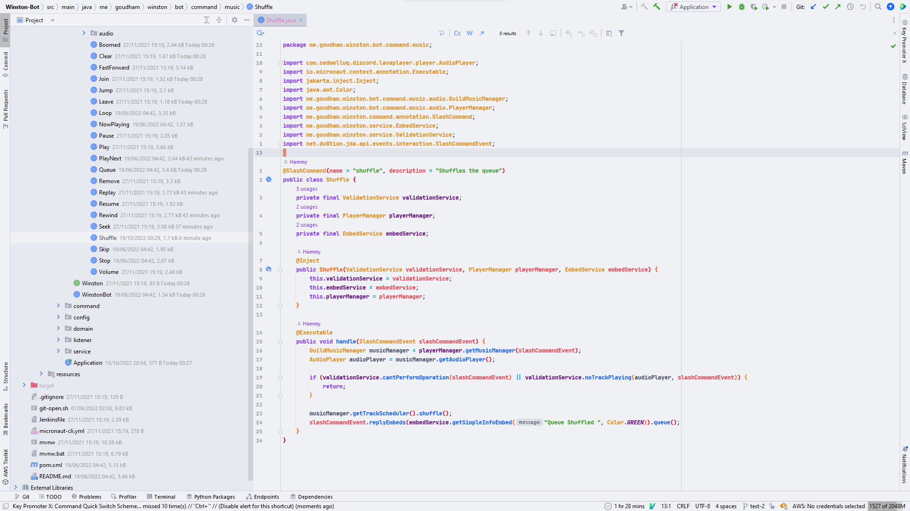
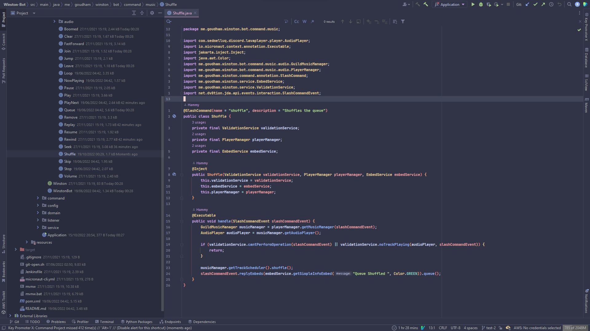
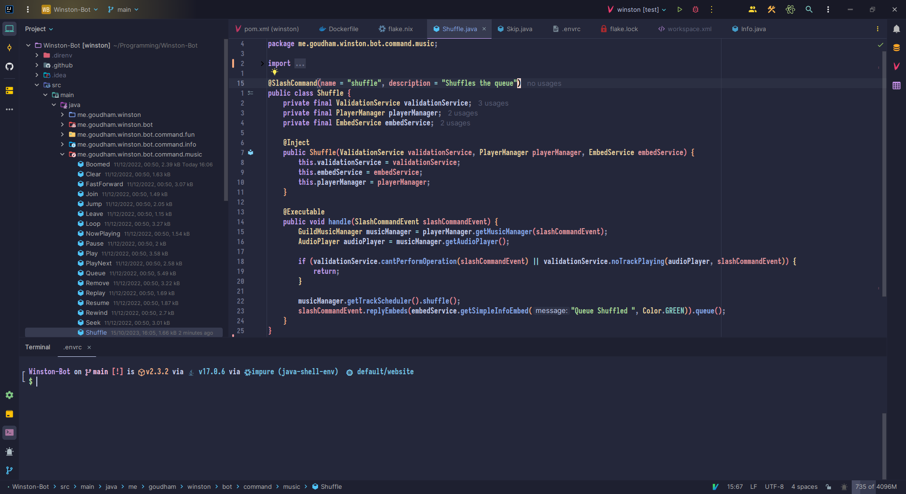
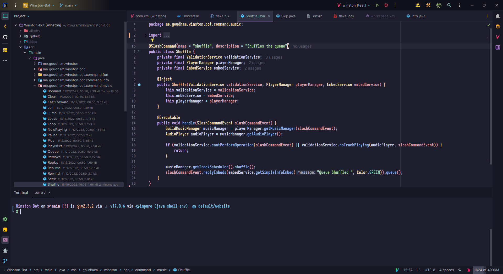
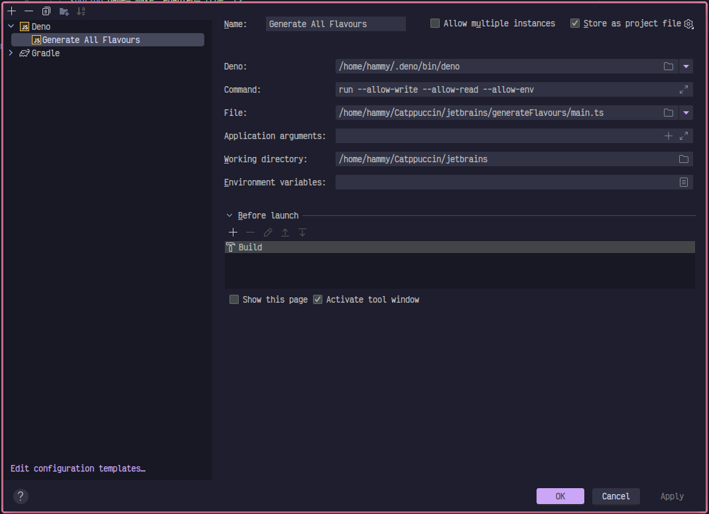
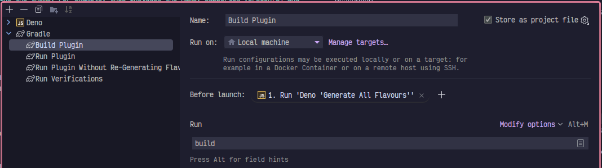
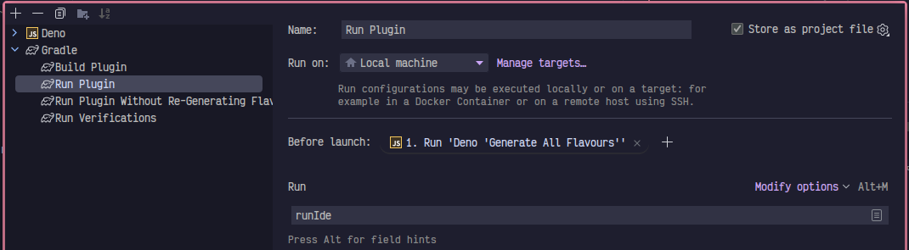

<!-- Plugin description -->
<h3 align="center">
	 
	
	Catppuccin for <a href="https://www.jetbrains.com/">JetBrains IDEs</a>
	
</h3>
<!-- Plugin description end -->

    
    
    
    

  

## Previews

🌻 Latte

🪴 Frappé

🌺 Macchiato

🌿 Mocha

## Installation

- Using IDE built-in plugin system:

<kbd>Settings/Preferences</kbd> > <kbd>Plugins</kbd> > <kbd>Marketplace</kbd> >
<kbd>Search for "Catppuccin Theme"</kbd> >
<kbd>Install Plugin</kbd>

- Manually:

  Download the
  [latest release](https://github.com/catppuccin/jetbrains/releases/latest) and
  install it manually using
  <kbd>Settings/Preferences</kbd> > <kbd>Plugins</kbd> > <kbd>⚙️</kbd> >
  <kbd>Install plugin from disk...</kbd>

## Contributing

First, thank you for wanting to contribute! Make sure to read the organisation-wide [CONTRIBUTING.md](https://github.com/catppuccin/.github/blob/main/CONTRIBUTING.md)!

Listed below are details on the  file structure, optimal development workflow and general notes that are useful 
for developing on this port. 

> **Note**  
> Please ensure that you have read the relevant JetBrains documentation listed [here](https://plugins.jetbrains.com/docs/intellij/developing-themes.html) 
> which will answer any questions surrounding creating, running and deploying a JetBrains theme.

### File Structure

- `.github/workflows/` - CI/CD workflows for building and distributing `.jar` files
- `.run/` - Collection of useful Intellij run configuration tasks that ease the development process
- `generateFlavours/` - JS/TS code that generates all 4 Catppuccin flavours into the specified XML format that JetBrains require
  - `main.ts` - Generates `.theme.json` and `.xml` files. The `.theme.json` file relates to the UI elements whereas the `.xml` file (derived solely from the `.template.xml`) is for the Editor elements entirely (e.g the code syntax highlighting)
  - `template.xml` - As mentioned above, these are all the highlights for everything to do regarding the editor. It is important to note that we have included some [handlebars](https://handlebarsjs.com/) syntax to allow for easier generation of the Latte flavour compared to Frappé, Macchiato and Mocha
- `src/main/resources/META-INF` - Contains metadata that is shipped with the `.jar` including the Catppuccin logo, id, name, and description
- `build.gradle.kts` - Standard gradle build file defining custom build tasks on top of defaults
- `gradle.properties` - Properties that define the theme. For example, this includes the name, supported version(s) and type of IDE to build locally for testing, etc
- `settings.gradle.kts` - Contains the root project name

### Development Workflow

#### Requirements

- Deno v1.27+

#### Debugging Tools

JetBrains (thankfully) provide internal debugging tools to aid with theme creation in their IDE's. Please refer to the documentation below:

- [Internal Actions Menu](https://plugins.jetbrains.com/docs/intellij/internal-actions-intro.html)
- [UI Inspector](https://plugins.jetbrains.com/docs/intellij/internal-ui-inspector.html)
- [LaF Defaults](https://plugins.jetbrains.com/docs/intellij/internal-ui-laf-defaults.html)

#### IDE Build Configuration

> **Note**  
> The configuration in the given screenshots below contain hardcoded paths based on my personal system. Please ensure 
> that you tweak your configurations to make sense within the context of your own system setup 
> 
> ~ Hammy

You should also ensure that the `Generate All Flavours.run.xml` configuration has been correctly identified by your 
JetBrains IDE of choosing.

For reference, your `Generate All Flavours` build configuration should look like the following:

The build configurations for `Build Plugin` and `Run Plugin` should also include `Generate All Flavours` as pre-launch
tasks. (This is to ensure that the latest changes are included with each local build of the theme.) For reference, they
should look like the following: 

`Build Plugin`

`Run Plugin`

#### Example Scenario

Some high level steps are shown below in an example development workflow for editing Link (UI) & Selection (Editor) highlights

##### High Level

1. Edit Link highlight colour within `main.ts`
2. Edit Selection highlight colour within `template.xml`
3. Run `Build Plugin` build configuration (there should be updated files in `src/main/resources/themes` and the resulting `.jar` file should be under `build/libs`)
4. Run `Run Plugin` build configuration (the result should be an entire IDE with the new changes applied)
5. Observe new highlights within the test IDE instance
6. If you aren't happy with your changes, repeat from step 2
7. Once happy, update `CHANGELOG.md` with new updates to the theme under relevant headings
8. Push changes to new remote branch
9. Create pull request
10. ???
11. Profit

#### CI/CD Pipeline

To ease the development and deployment process, we have defined a full CI/CD pipeline that is capable of producing test
`.jar` binaries on each relevant push, releasing draft binaries to GitHub and deploying straight to the JetBrains
Marketplace.

- `build.yml` - Runs on every relevant push/pull-request, it builds the `.jar` and uploads it for anyone to download it
- `publish.yml` - Runs on every git tag starting with `v*`
  - Patches the `CHANGELOG.md` into the `.jar` for updated release notes
  - Builds the `.jar`
  - Publishes to the JetBrains Marketplace
  - Creates a draft release on GitHub for maintainers with the new `.jar` to manually review and release

## 💝 Thanks to

- [tiepp](https://github.com/tiepp)
- [Quentin](https://github.com/quentinguidee)
- [Hamothy](https://github.com/sgoudham)
- [winston](https://github.com/nekowinston)

&nbsp;

Copyright &copy; 2022-present <a href="https://github.com/catppuccin" target="_blank">Catppuccin Org</a>

