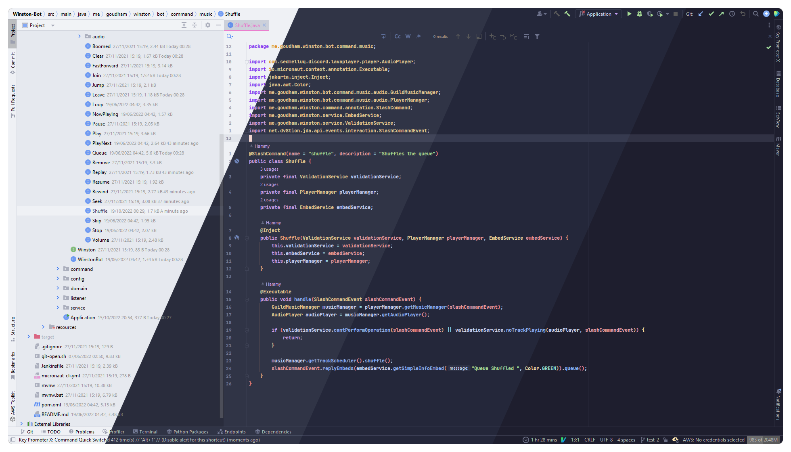
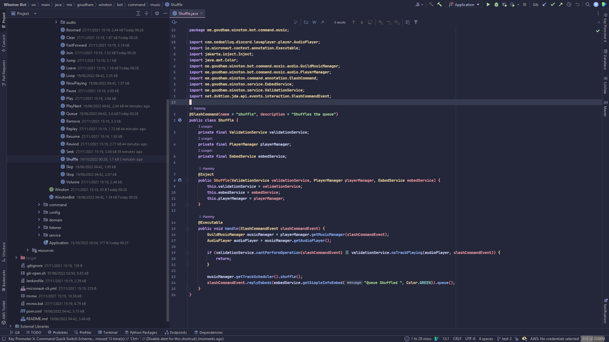
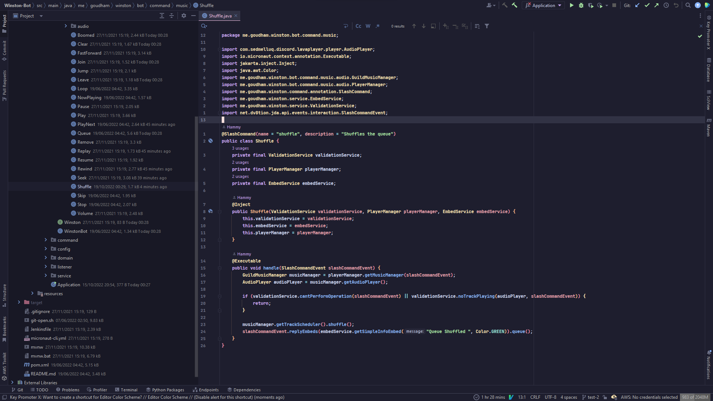

<!-- Plugin description -->
<h3 align="center">
	 
	
	Catppuccin for JetBrains IDEs
	
</h3>
<!-- Plugin description end -->

    
    
    
    

  

## Previews

🌻 Latte

🪴 Frappé

🌺 Macchiato

🌿 Mocha

## Installation

- Using IDE built-in plugin system:

<kbd>Settings/Preferences</kbd> > <kbd>Plugins</kbd> > <kbd>Marketplace</kbd> > <kbd>Search for "Catppuccin Theme"</kbd> >
<kbd>Install Plugin</kbd>

- Manually:

  Download the [latest release](https://github.com/catppuccin/jetbrains/releases/latest) and install it manually using
  <kbd>Settings/Preferences</kbd> > <kbd>Plugins</kbd> > <kbd>⚙️</kbd> > <kbd>Install plugin from disk...</kbd>

## 💝 Thanks to

- [tiepp](https://github.com/tiepp)
- [Hamothy](https://github.com/sgoudham)
- [winston](https://github.com/nekowinston)

&nbsp;

Copyright &copy; 2021-present <a href="https://github.com/catppuccin" target="_blank">Catppuccin Org</a>

